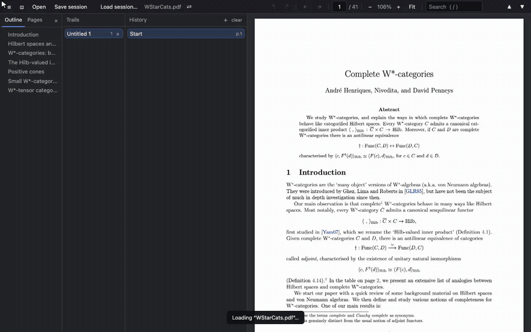

# Paper Trail

**A PDF reader that remembers how you got where you are.**

Reading a paper means chasing references: Lemma 3.16 sends you to
Definition 2.4, which sends you to Equation (7.2) — and five jumps later
you've lost the page you were actually reading. Paper Trail records every
jump on a **reading trail**, so you can always pop back to the exact spot
you left, branch off side explorations, and save the whole thing to a
file you can come back to (or keep in git next to the paper).



<p align="center">
  
  
</p>

## Quick start

You need [Node.js](https://nodejs.org). The desktop app works out of the
box; in-browser use wants a Chromium-based browser (Chrome, Edge, Brave)
for session saving.

```sh
npm install
npm run build

npm run desktop              # desktop app with native menus
# — or —
npm start                    # then open http://127.0.0.1:8377
```

macOS extras:

```sh
python3 desktop/make_app.py  # double-clickable "Paper Trail.app" in dist/
python3 desktop/launch.py    # build-if-needed + serve + open browser
```

Open a PDF with the **Open** button or drop it anywhere in the window.

## Reading with trails

- **Follow any internal link** — it's pushed onto your trail, labelled
  from the text around it ("Lemma 3.16", "(7.2)").
- **Backspace** pops back to the *exact* position you left;
  **Shift+Backspace** goes forward again. Following a new link mid-trail
  overwrites the entries above you, exactly like browser history.
- **Cmd/Ctrl+click a link** (or middle-click) to **branch**: your whole
  history is copied into a new trail and the jump happens there — so Back
  still works, unlike a browser tab. Trails live in the sidebar: switch,
  rename (double-click), close.
- **Mark a spot** you reached by scrolling or searching with the `+`
  button above the history list (or press `m`) — recorded like a link
  jump.
- **Hover a link** for a moment to preview its destination in a panel the
  width of the page: scroll inside it, drag its bottom edge to resize.
- **Undo** (`Cmd/Ctrl+Z`) reverts history changes — an overwritten
  forward tail, a branch, a closed or renamed trail, even a replaced PDF.
- Entries never move on their own: scrolling doesn't touch them.
  Re-anchor one deliberately with the ⌖ button on its row (hover).

The leftmost panel shows the document **Outline** and **Pages**
(thumbnails); close it with ×, reopen it from the toolbar. All panels
resize by dragging their edges — each keeps its own width.

## Saving your place: reading sessions

**Save session** (`Cmd/Ctrl+S`) writes everything — all trails, position,
zoom — to a small plain-text file (`<pdf>.trail`) wherever you choose. It
diffs cleanly, so versioning it in git alongside the paper works well.

- Open the PDF first and use **Load session…**, or open the session file
  first — the app shows which PDF it belongs to and asks for it (or
  reopens it silently when it can).
- Once saved, the session **auto-saves continuously**; a dot on the Save
  button means unsaved changes, and closing warns if anything is unsaved.
- Opened a different PDF than the session was saved with? A banner says
  so; **Use this PDF** adopts it. Got a revised version of the paper?
  **⇄ Replace PDF** swaps the file and keeps your whole reading history
  (undoable).

## Keyboard shortcuts

| Key | Action |
| --- | --- |
| `Backspace` / `Alt+←` | Back (pop up the trail) |
| `Shift+Backspace` / `Alt+→` | Forward |
| `Cmd/Ctrl+click` / middle-click a link | Branch into a new trail |
| `m` (`Shift+M` to branch) | Mark the current position |
| `Cmd/Ctrl+Z` / `Cmd/Ctrl+Shift+Z` | Undo / redo history changes |
| `/` or `Cmd/Ctrl+F` | Search (`Enter` / `Shift+Enter` for matches) |
| `+` / `-` / `0` | Zoom in / out / fit width (trackpad pinch works) |
| `Cmd/Ctrl+S` | Save session |
| `t` | Toggle sidebar |
| `o` | Open a file |

## Notes

- Session files need the File System Access API: any Chromium-based
  browser, or the desktop app. Everything else works in modern browsers.
- Search matches can't span line breaks.

Developer documentation — architecture, tests, the session-file format,
performance analysis — lives in [CONTRIBUTING.md](CONTRIBUTING.md).
