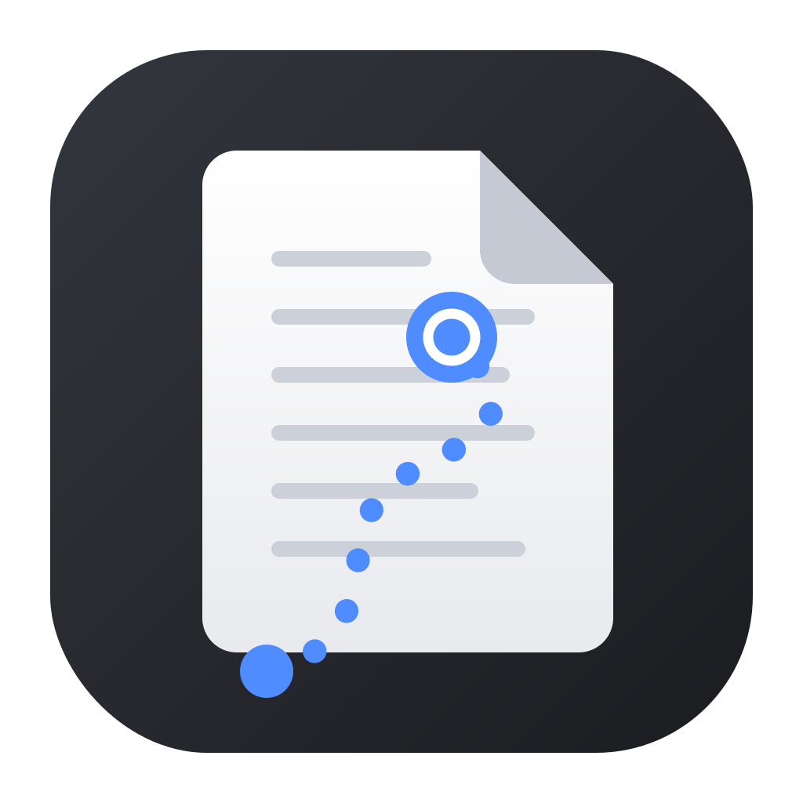
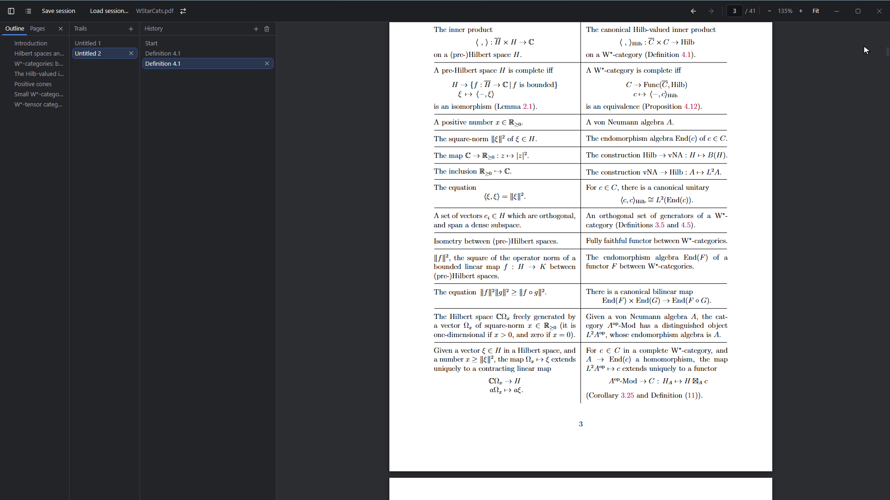
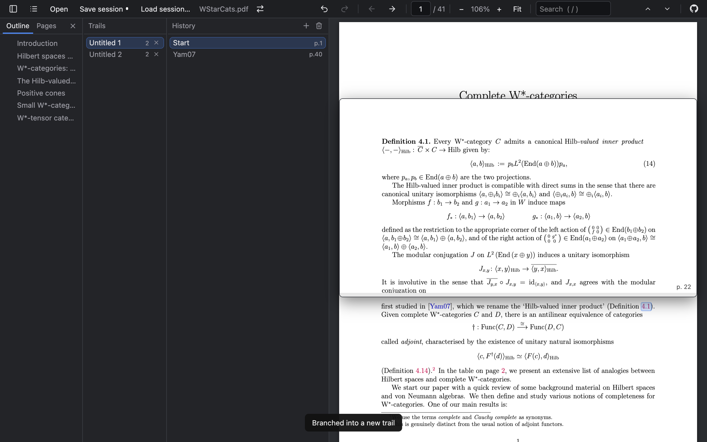

  

# Paper Trail

**A PDF reader that remembers how you got where you are.**

Reading a paper means chasing references: Lemma 3.16 sends you to
Definition 2.4, which sends you to Equation (7.2) — and five jumps later
you've lost the page you were actually reading. Paper Trail records every
jump on a **reading trail**, so you can always pop back to the exact spot
you left, split side explorations onto their own trails, and save it to a
file you can come back to (or keep in git next to the paper).

Following references, popping back, jumping around the history, and
continuing in a new trail:

https://github.com/user-attachments/assets/4ca439e5-500b-4005-b7ef-f6311bc508af

  
  

## Quick start

- **Use it in the browser**: https://paper-trail-green.vercel.app
  (a Chromium-based browser — Chrome, Edge, Brave — is needed for saving
  session files)
- **Or download the desktop app** (works offline):
  grab the `.dmg` (macOS) or `.exe` installer (Windows) from the
  [**Releases page**](https://github.com/DE0CH/paper-trail/releases).

Then open a PDF — the **Choose a PDF…** button on the welcome screen,
`Cmd/Ctrl+O`, or just drop the file anywhere in the window. (Building
from source is covered in [CONTRIBUTING.md](CONTRIBUTING.md).)

## Trails: how it works

A **trail** is the path you took through the paper: every jump you make
— following a reference, clicking an outline or thumbnail entry,
marking a spot — appends a labelled entry to it, and the entry pins the
exact position you jumped *from*, so Back always returns you precisely
there. A trail behaves exactly like browser history: Back and Forward
walk it, and jumping somewhere new while you're partway down discards
the entries above you.

You can keep **multiple trails**. `Cmd/Ctrl+click` a link to duplicate
your trail so far onto a new one and follow the link there, leaving
the original intact — like opening a link in a new browser tab, except
Back still works in the copy. Do that whenever a side quest starts
("I'll just quickly check Lemma 2.3…") and switch between trails in
the sidebar.

## Reading with trails

- **Follow any internal link** — it's pushed onto your trail, labelled
  from the text around it ("Lemma 3.16", "(7.2)").
- **Back** (`Alt+←`) pops back to the *exact* position you left;
  **Forward** (`Alt+→`) goes down again. Following a new link mid-trail
  overwrites the entries above you, exactly like browser history.
- **Cmd/Ctrl+click a link** (or middle-click) to follow it **in a new
  trail**: your history so far is duplicated onto it, so Back still
  works — unlike a browser tab. Trails live in the sidebar: switch,
  rename (double-click), duplicate, close, or start a fresh one with +.
- **Mark a spot** you reached by scrolling or searching with the `+`
  button above the history list (or `Cmd/Ctrl+D`) — recorded like a
  link jump.
- **Hover a link** for a moment to preview its destination in a panel the
  width of the page: scroll inside it, drag its top or bottom edge to
  resize.
- **Undo** (`Cmd/Ctrl+Z`) reverts history changes — an overwritten
  forward tail, a new trail, a closed or renamed trail, even a
  replaced PDF.
- Entries never move on their own: scrolling doesn't touch them.
  Re-anchor one deliberately with the ⌖ button on its row (hover), or
  press `Cmd/Ctrl+G` for the current entry.

The leftmost panel shows the document **Outline** and **Pages**
(thumbnails); close it with ×, reopen it from the toolbar.

## Saving your place: reading sessions

**Save session** (`Cmd/Ctrl+S`) writes everything — all trails, position,
zoom — to a small plain-text file (`<pdf>.ptl`) wherever you choose. It
diffs cleanly, so versioning it in git alongside the paper works well.

- Once saved, the session **auto-saves continuously**; a dot on the Save
  button means unsaved changes.
- Closing the desktop app with unsaved changes doesn't nag: it saves in
  the background and only asks if that save fails.
- Got a revised version of the paper? The **⇄** button next to the file
  name swaps in the new PDF and keeps your whole reading history.
- To pick your reading back up later, use the **Recent** list on the
  welcome screen — it reopens the PDF together with its session — or
  click **Load session…** in the toolbar.
- Session files are made to last: every future version of Paper Trail
  opens sessions saved by this one.

## Keyboard shortcuts

Press `?` (`Shift+/`) in the app for
the full cheat-sheet.

Here are some important ones:

| Key | Action |
| --- | --- |
| `Alt+←` / `Alt+→` | Back / forward along the trail |
| `Cmd/Ctrl+click` a link | Follow it in a new trail |
| `Cmd/Ctrl+D` | Mark the current position |
| `Cmd/Ctrl+S` | Save session |

## Notes

- Session files need the File System Access API: any Chromium-based
  browser, or the desktop app. Everything else works in modern browsers.
- Search matches can't span line breaks.

Developer documentation — architecture, tests, the session-file format,
performance analysis — lives in [CONTRIBUTING.md](CONTRIBUTING.md).
